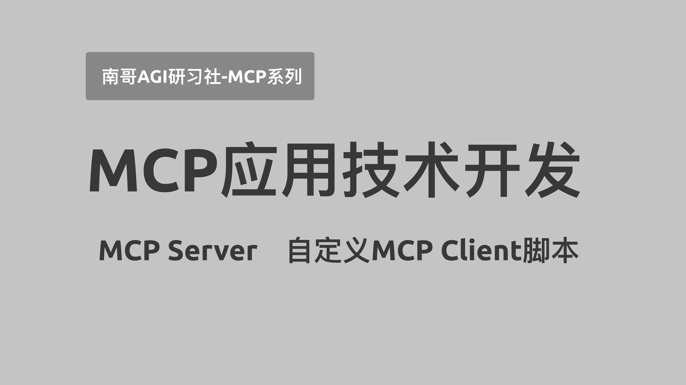

# 南哥AGI研习社-MCP系列       
                      

相关视频合集整理:              
大模型应用开发-MCP系列】01 高德地图MCP Server全流程实操演示 已覆盖12大核心服务接口，提供全场景覆盖的地图服务           
https://youtu.be/RKYKr3BABhc                 
https://www.bilibili.com/video/BV1YMfuYvEUQ/  
                               
          

